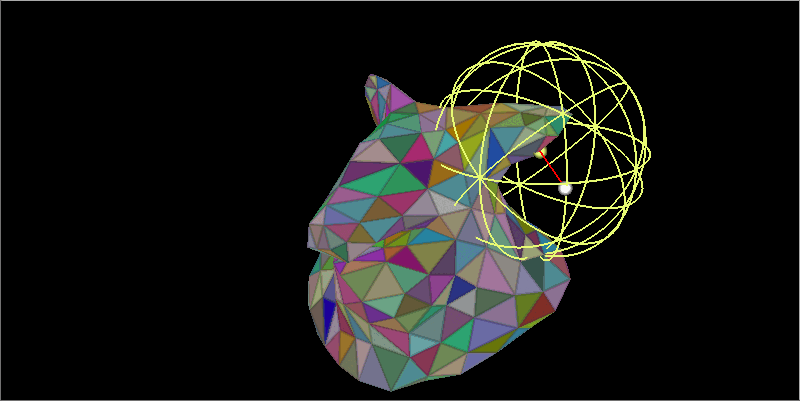
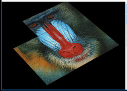
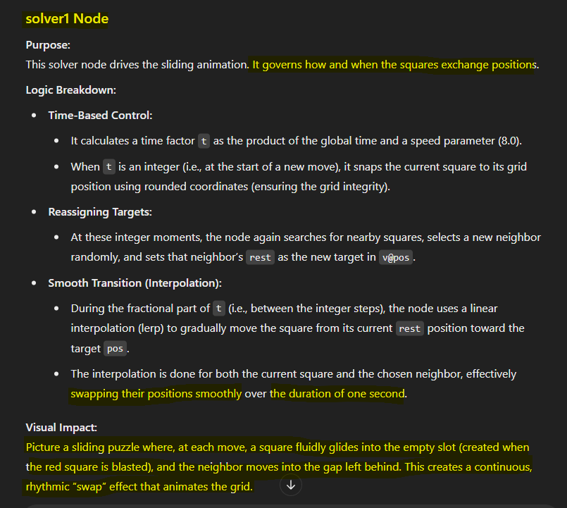

# Purpose

This document outlines the evaluation conducted to ensure the quality and reliability of Houdini 2 Chat HDA.

# Evaluation Criteria
Evaluation criteria is based on LLM/AI Tool ability to recognize the following:

- Understanding the Scene Representation:
  - Nodes and their connections
  - Network Structure
    - Branches In/Out
    - Loops
    - Network Boxes/Sticky Notes
  - Node Parameters
    - Values/Expressions/References
    - User Defined, defaults
- Understanding the Scene Logic:
  - Nodes meaning and purpose
  - Partitioning the Network into meaningful parts
  - Network Logic and Purpose
- Visualization:
  - Visualizing the Output
  - Visualizing Animation
  - Visualizing Geometry
- Explain the Scene.
- Suggest Fixes and solutions to Requests.
- Working seamlessly across LLMs/AI Tools
  - Try Multiple LLMs with same prompts
  - Try Multiple AI Tools with same prompts
  - Get acceptable results with Regular and Thinking Models

 

>[!NOTE]
> To ensure LLM didn't train on these specific scenes, we stripped identifying information from scene descriptions for some of them. We will provide later evaluation of non public scenes that we tested internally.

 

# Scene Credits
We have picked some of the most popular Houdini Tutorials and Examples to evaluate Houdini 2 Chat. We have made minor changes to a few of the scenes to demonstrate some capabilities or overcome known limitations.
Full credit to the following Channels/Authors for providing these scenes to the Houdini Community. I have greatly learned from each one of them.
- [CGWiki](https://tokeru.com/cgwiki/)
- [Mr. Junichiro Horikawa](https://www.youtube.com/@junichirohorikawa)
- [Entagma](https://www.youtube.com/@entagma)
- [Simple and Procedural](https://www.youtube.com/@simpleandprocedural)

 

# Detailed Results

## 1. [xyzdist Demo](https://tokeru.com/cgwiki/HoudiniVex3.html#vex-section-3) on CGWiki

🌀 `**Description**` Visualizing a point orbiting around a 3d Surface  
🔰 `**Level**` Easy  
🧩 `**Elements**` 26 Nodes, 5 Sticky Notes, 17 Branches  
🔄 `**Variations**` With Sticky Notes, Without Sticky Notes  
🤖 `**Chat Results**` Claude 3.7 Sonnet/Artifacts ([w. Notes](https://claude.ai/share/609877e3-c941-4e7c-97dd-4b984922ce61), [wo. Notes](https://claude.ai/share/a6c540ea-4bd7-4a9c-ac27-e62694c86fb1)), Gemini 2.0 Flash/Chat [w.o. Notes](https://g.co/gemini/share/0268584361bc)  
📝 `**Analysis**` Great Description of the scene, with or without the hints on the Sticky Notes. Claude's output is much better than Gemini's, but both are acceptable.  
📊 `**Evaluation Grade for AI**` &nbsp; &nbsp;B

<table>
  <tr>
    <td></td>
    <td></td>
  </tr>
</table>

Click to Expand Details

### Extract from CGWiki

> xyzdist finds the distance, primnum, uv of the closest prim, a point is made at that location, its colour is set from the closest prim, a red line is drawn from the orbiting point to the new point, and finally a wireframe sphere is generated on the new point, its colour also matches the prim its currently on, and its radius is set from the distance returned from xyzdist, so it alwasy just touches the orbiting point.

### Extract from Claude Analysis

## 2. [The 8-Puzzle](https://tokeru.com/cgwiki/HoudiniVex3.html#sliding_puzzle) on CGWiki

🌀 `Description` Animate the shuffling of an 8-Puzzle  
🔰 `Level` Medium  
🧩 `Elements` 10 Nodes, 1 Branch  
🔄 `Variations` None  
🤖 `Chat Results` [Claude 3.7 Sonnet](https://claude.ai/share/4f87bac2-b60c-4636-bc0a-f689e7831d81) -  [ChatGPT o3-mini-high](https://chatgpt.com/share/67be57ec-98dc-800b-86bc-71f0eb4ef708) - [Grok 3.0](https://grok.com/share/bGVnYWN5_84233782-b228-4cbe-aef9-1cfaae9661b5)  
📝 `Analysis` None of the models got the animation logic right, until I gave them a couple of hints.
- `o3-Mini` got the animation and the name correctly.
- `Claude` got the animation better than o3-mini, but failed to name the game until he got a third hint.
- `Grok 3` needed more hints, he got the grid points incorrect, but with the right hints, he got the animation and the game name (It took a few minutes to think on each step).  
  
📊 `Evaluation Grade for AI` &nbsp; &nbsp;B

<table>
  <tr>
    <td></td>
    <td></td>
  </tr>
</table>

Click to Expand Details

 

**Prompt Used**
> You are a SideFx Houdini Expert and Helpful assistant, looking at pseudo-code representation of a Houdini Network. Visualize the Node Network by reflecting on the branch connections, loops, vex wrangles, and node definition. Can you explain the purpose of this Network and its key components in Full Details? Can you break it down as smaller logical functions, with inputs/outputs/purpose for each. Think of the (animated) visual output of each function and describe it. Name the game!

**Second Prompt**
> ok i need to give you a couple of hints. the assemble1 node will convert the grid into 9 packed squares, you can check what assemble node does to achieve that. the second hint, the blast node deletes one of the squares (0) which is the one colored red. its a square not a point, since its a packed primitive. can you re-imagine again using tis info?

### o3-mini High, guessing the game 

### o3-mini High, Explaining the solver

### Claude explains the game, but doesn't get the name

### Claude figures the name, after a desperate hint

### Grok 3, Explaining the game

## 3. [Procedural Burger](https://www.youtube.com/watch?v=cevKyItRvTg) on Simple and Procedural Channel

🌀 `Description` Build the Procedural components of a delicious burger and simulate them falling down [download](https://simpleandprocedural.gumroad.com/l/hfs)  
🔰 `Level` Hard  
🧩 `Elements` 88 Nodes, 44 Branches, 9 Network Boxes  
🔄 `Tweaks` Rewired for better chat experience, removed all text indicating burger ingredients  
🤖 `Chat Results` [Claude 3.7 Sonnet](https://claude.ai/share/253544b8-ee30-4c0e-927e-8554bd448c0b) -  [ChatGPT o3-mini-high](https://chatgpt.com/share/67be3742-b604-800b-bc94-6d81457d936b) - [Grok 3.0](https://grok.com/share/bGVnYWN5_b7f8cd42-bb9e-4ccd-865c-7c766ade72f7)  
📝 `Analysis` All Models were good at analyzing the shapes, but only Claude could guess it's a burger, o3-mini-High and Grok guessed few of the burger components correctly.
- `o3-Mini-High`  guessed 6 out of 7 elements correctly.
- `Claude 3.7 Sonnet` Guessed it correctly with a small hint that it is looking at an organic object.
- `Grok 3` After I told him it's a burger, it guessed only 3 components correctly out of 7  
  
📊 `Evaluation Grade for AI` &nbsp; &nbsp;B

<table>
  <tr>
    <td></td>
    <td></td>
  </tr>
</table>

Click to Expand Details

 

**Prompt Used**
> You are a SideFx Houdini Expert and Helpful assistant, looking at pseudo-code representation of a Houdini Network. Visualize the Node Network by reflecting on the branch connections, loops, vex wrangles, and node definition. Can you explain the purpose of this Network and its key components in Full Details? also, i need you to imagine the different shapes in each OUT node, that are merged together in a OUT_SECRET node at the end

**Second Prompt**
> i believe you can guess it if you think harder,  think about objects 1 to 6, their shapes, their colors, their relative sizes, their possible relative positions, and you can guess this organic item correctly and its individual elements too

### Claude was the best at guessing the burger and 6 out of 7 elements correctly!

### o3-mini High, guessing 6 out of 7 elements correctly 

### Grok 3, guessed a jellyfish, then a pomegranate with the second prompt.

### Grok 3, After I told him it's a burger, it guessed only 3 components correctly out of 7

 

TBD - More Scenes

## TBD 

| Test | Provider | Level | Model/Host | Results |
|----------|----------|------------|-----------|----------|
| Fibonacci Flower   [Video](https://www.youtube.com/watch?v=nPWQpQQgWJM) - [Hip File](https://github.com/jhorikawa/HoudiniHowtos/tree/master/Live-0090%20Fibonacci%20Flower) | Mr. Junichiro Horikawa   Houdini Algorithmic Live|  TBD | GPT4o/ChatGPT Canvas| TBD
| Interference Patterns on Surfaces   [Video](https://www.youtube.com/watch?v=IliafCzn82I) - [Hip File](https://entagma.com/interference-patterns-on-surfaces/) | Entagma |  TBD | GPT4o/ChatGPT Canvas| TBD
| Rubik's Cube | CGWiki | TBD | Gemini 2.0 Flash | [Chat Link](https://g.co/gemini/share/1cd75b21ef51)
|  |  |  | ChatGPT 4o   ChatGPT o1| [Chat Link](https://chatgpt.com/canvas/shared/67bdf0c4ce148191b72c1b9820b93021)

 

# Third Party Evaluation

If you are using Houdini 2 Chat HDA in a production environment or just reviewing it on your channel, feel free to provide feedback and review results, we will be more than happy to hear from you and share your feedback with the community.

# Internal Evaluation

TBD