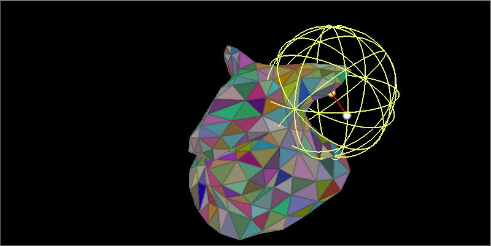
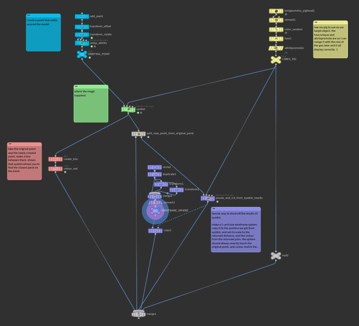
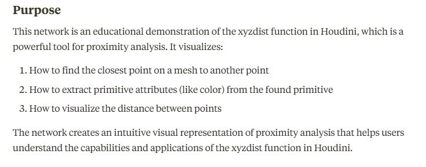
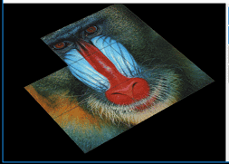
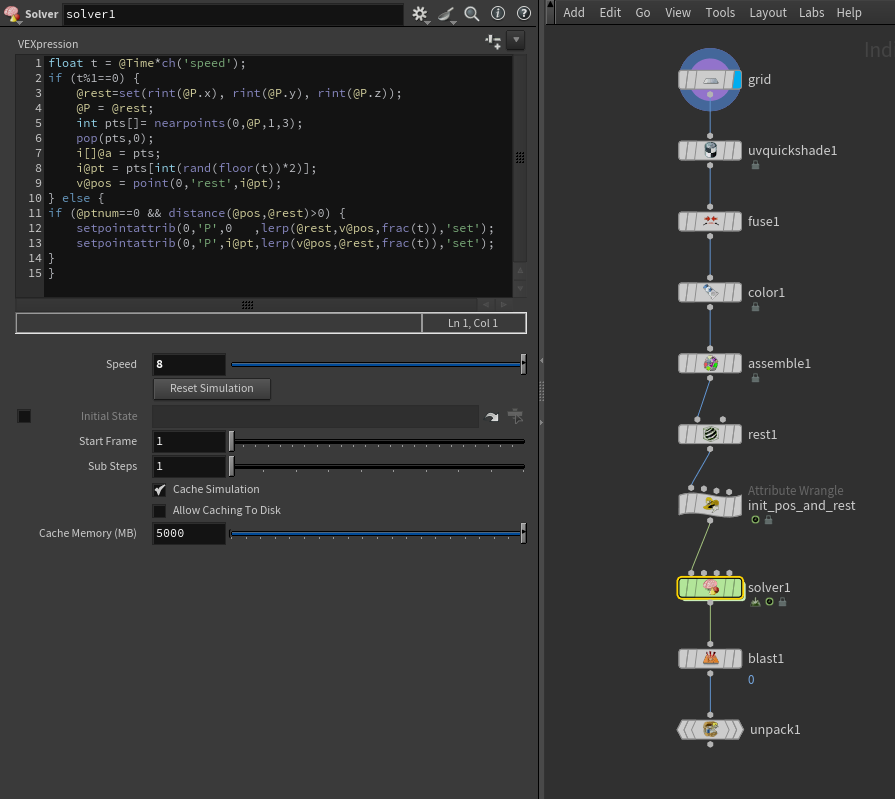
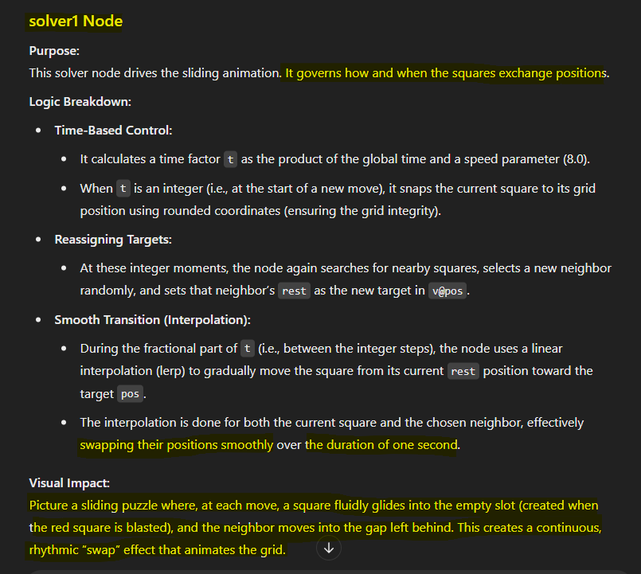
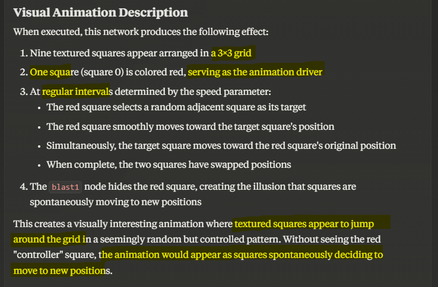
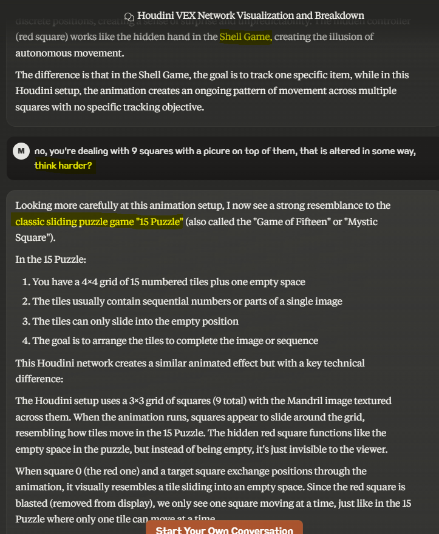
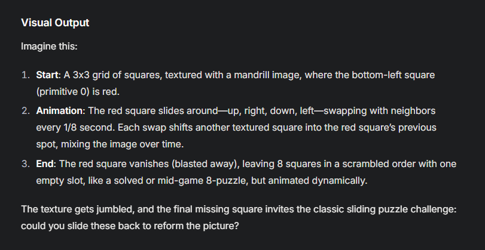

# Problem

`SideFx Houdini` is arguably the most `powerful` 3D software, yet it is also the `most complex` with a huge set of features, procedural nature, network structure, coding ability,  `thousands of node types`.\
Building, understanding, maintaining and debugging Networks for serious tasks can be `overwhelming` and `challenging`.

`AI Productivity tools` have been helping every Product and some of them have been tightly integrated into some of these products, pushing their productivity to the next level.

While most of the 3D software apps are not taking the full advantage of AI tools, `SideFX Houdini` has `unique characteristics` that make it a `perfect candidate` for AI tools integration. The `procedural nature` of Houdini and the fact that its Network description is similar to writing software, `makes it ideal` for AI Tools that understand code, `AI Code Assistants` to be specific.

# Early Approaches

People have tried 2 approaches to use AI tools with Houdini.

## Approach 1 - Chat with LLM

Describe a local problem in a chat with an AI tool and get a solution, like asking AI to write VEX code to do a certain task, or copy/paste VEX code/errors and ask for enhancements/corrections.

**Limitations**
- Too much time wasted `describing complex Networks`, and it's always hard to describe the context.
- Jumping between `multiple chat contexts` back and forth, you have to re-describe it all again.
- When you make `changes to your network`, you may need to describe the whole thing again.

## Approach 2 - LLM API inside Houdini

Use LLM APIs inside Houdini to ask questions and get VEX Code directly inside Houdini. There is a free Houdini HDA that does that.

**Limitations**

- It `doesn't see the context`, only your prompt.
- You are limited to `specific LLMs`
- You `pay` for every API call, `no free option`
- When `APIs are upgraded`, you have to `wait for the HDA` to be updated.

 

# Enters Houdini 2 Chat

With Houdini 2 Chat, you have none of these limitations.
- `No need to describe` your network, Houdini 2 Chat does that for you.
- You can use Houdini 2 Chat with almost `any AI Tool` and `any LLM` of your choice.
- New Tools, new LLMs appear every day in this fast paced domain, No need to wait for a new Integration. You can use `New LLMs` as soon as they are available.
- Houdini 2 Chat is `free to use`, also Most powerful AI tools have `free plans`.

## Features
While it is a `proof of concept`, Houdini 2 Chat has the following features today:

- Provides an `LLM Chat ready description` of your Scene
  - Nodes, Parameters
  - Expressions and References
  - User Defined parameters
  - Network Connections, and Loops
  - Sticky Notes and Network Boxes
- Works with `any LLM` (Tested with ChatGPT Models, Gemini2, Grok3, Claude 3.7)
- Works with `any AI Code Assistant` (Tested with Github Copilot)
- Works with Special LLM Chat Modes (Tested ChatGPT `Canvas`, Claude `Artifacts`, Google NotebookLM)
- Option for `separate files` per Node/per Network Box
- `Filter Scene` Output by specific Nodes/specific Network Boxes

## Not yet Implemented
- Limited to Obj Level nodes only.
- Recursive Loops and Recursive Network Boxes
- Networks inside Networks (subnetworks, HDA Networks)
- Full Testing and Evaluation
  
 

# Use Cases

- Explain complex Houdini scenes
- Accelerate learning of Houdini
- Get help with coding in VEX, Python, or HScript
- Documentation of Houdini Networks
- Get suggestions to fix problems in Houdini scenes
- Find better workflows from thousands of Houdini Nodes and Parameters you may not know.
 
# How to Install
- Download the latest [HDA](https://github.com/rendermagix/houdini2chat/releases) from the Github [Repo]()
- To install globally, add it in Houdini otls Folder ([Where?](https://www.sidefx.com/docs/houdini/assets/install.html)).

# How to Use
- Open any Houdini Scene, browse to your network
- Drop a Houdini 2 Chat Node
- Hit Export 2 Chat Button.
- Paste the output File(s) in your LLM Chat or link the output folder to your AI Code Assistant for seamless updates.
- Use any of the prompts provided in the output file(s) to get started

> [!NOTE]
> To install the Asset in this Scene only, follow instructions [here](https://www.sidefx.com/docs/houdini/assets/install.html)

# What's Next

# Does it really work?

## Evaluation Criteria
Evaluation criteria is based on LLM/AI Tool ability to recognize the following:

- Understanding the Scene Representation:
  - Nodes and their connections
  - Network Structure
    - Branches In/Out
    - Loops
    - Network Boxes/Sticky Notes
  - Node Parameters
    - Values/Expressions/References
    - User Defined, defaults
- Understanding the Scene Logic:
  - Nodes meaning and purpose
  - Partitioning the Network into meaningful parts
  - Network Logic and Purpose
- Visualization:
  - Visualizing the Output
  - Visualizing Animation
  - Visualizing Geometry
- Explain the Scene.
- Suggest Fixes and solutions to Requests.
- Working seamlessly across LLMs/AI Tools
  - Try Multiple LLMs with same prompts
  - Try Multiple AI Tools with same prompts
  - Get acceptable results with Regular and Thinking Models

 

>[!NOTE]
> To ensure LLM didn't train on these specific scenes, we stripped identifying information from scene descriptions for some of them. We will provide later evaluation of non public scenes that we tested internally.

## Scene Credits
We have picked some of the most popular Houdini Tutorials and Examples to evaluate Houdini 2 Chat. We have made minor changes to a few of the scenes to demonstrate some capabilities or overcome known limitations.
Full credit to the following Channels/Authors for providing these scenes to the Houdini Community. I have greatly learned from each one of them.
- [CGWiki](https://tokeru.com/cgwiki/)
- [Mr. Junichiro Horikawa](https://www.youtube.com/@junichirohorikawa)
- [Entagma](https://www.youtube.com/@entagma)
- [Simple and Procedural](https://www.youtube.com/@simpleandprocedural)

## Evaluation

### 1. [xyzdist Demo](https://tokeru.com/cgwiki/HoudiniVex3.html#vex-section-3) on CGWiki

🌀 `**Description**` Visualizing a point orbiting around a 3d Surface  
🔰 `**Level**` Easy  
🧩 `**Elements**` 26 Nodes, 5 Sticky Notes, 17 Branches  
🔄 `**Variations**` With Sticky Notes, Without Sticky Notes  
🤖 `**Chat Results**` Claude 3.7 Sonnet/Artifacts ([w. Notes](https://claude.ai/share/609877e3-c941-4e7c-97dd-4b984922ce61), [wo. Notes](https://claude.ai/share/a6c540ea-4bd7-4a9c-ac27-e62694c86fb1)), Gemini 2.0 Flash/Chat [w.o. Notes](https://g.co/gemini/share/0268584361bc)  
📝 `**Analysis**` Great Description of the scene, with or without the hints on the Sticky Notes. Claude's output is much better than Gemini's, but both are acceptable.  
📊 `**Evaluation Grade for AI**` &nbsp; &nbsp;B

<table>
  <tr>
    <td></td>
    <td></td>
  </tr>
</table>

Click to Expand Details

#### Extract from CGWiki

> xyzdist finds the distance, primnum, uv of the closest prim, a point is made at that location, its colour is set from the closest prim, a red line is drawn from the orbiting point to the new point, and finally a wireframe sphere is generated on the new point, its colour also matches the prim its currently on, and its radius is set from the distance returned from xyzdist, so it alwasy just touches the orbiting point.

#### Extract from Claude Analysis

### 2. [The 8-Puzzle](https://tokeru.com/cgwiki/HoudiniVex3.html#sliding_puzzle) on CGWiki

🌀 `Description` Animate the shuffling of an 8-Puzzle  
🔰 `Level` Medium  
🧩 `Elements` 10 Nodes, 1 Branch  
🔄 `Variations` None  
🤖 `Chat Results` [Claude 3.7 Sonnet](https://claude.ai/share/4f87bac2-b60c-4636-bc0a-f689e7831d81) -  [ChatGPT o3-mini-high](https://chatgpt.com/share/67be57ec-98dc-800b-86bc-71f0eb4ef708) - [Grok 3.0](https://grok.com/share/bGVnYWN5_84233782-b228-4cbe-aef9-1cfaae9661b5)  
📝 `Analysis` None of the models got the animation logic right, until I gave them a couple of hints.
- `o3-Mini` got the animation and the name correctly.
- `Claude` got the animation better than o3-mini, but failed to name the game until he got a third hint.
- `Grok 3` needed more hints, he got the grid points incorrect, but with the right hints, he got the animation and the game name (It took a few minutes to think on each step).  
  
📊 `Evaluation Grade for AI` &nbsp; &nbsp;B

<table>
  <tr>
    <td></td>
    <td></td>
  </tr>
</table>

Click to Expand Details

 

**Prompt Used**
> You are a SideFx Houdini Expert and Helpful assistant, looking at pseudo-code representation of a Houdini Network. Visualize the Node Network by reflecting on the branch connections, loops, vex wrangles, and node definition. Can you explain the purpose of this Network and its key components in Full Details? Can you break it down as smaller logical functions, with inputs/outputs/purpose for each. Think of the (animated) visual output of each function and describe it. Name the game!

**Second Prompt**
> ok i need to give you a couple of hints. the assemble1 node will convert the grid into 9 packed squares, you can check what assemble node does to achieve that. the second hint, the blast node deletes one of the squares (0) which is the one colored red. its a square not a point, since its a packed primitive. can you re-imagine again using tis info?

#### o3-mini High, guessing the game 

#### o3-mini High, Explaining the solver

#### Claude explains the game, but doesn't get the name

#### Claude figures the name, after a desperate hint

#### Grok 3, Explaining the game

